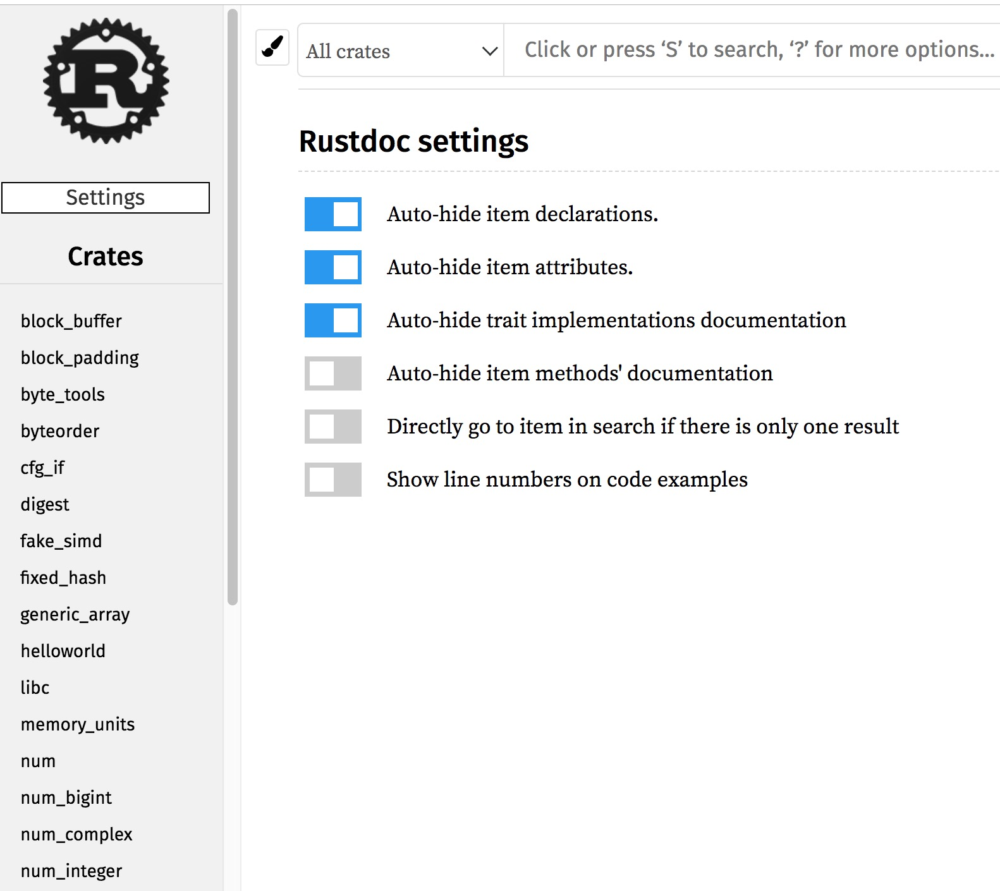
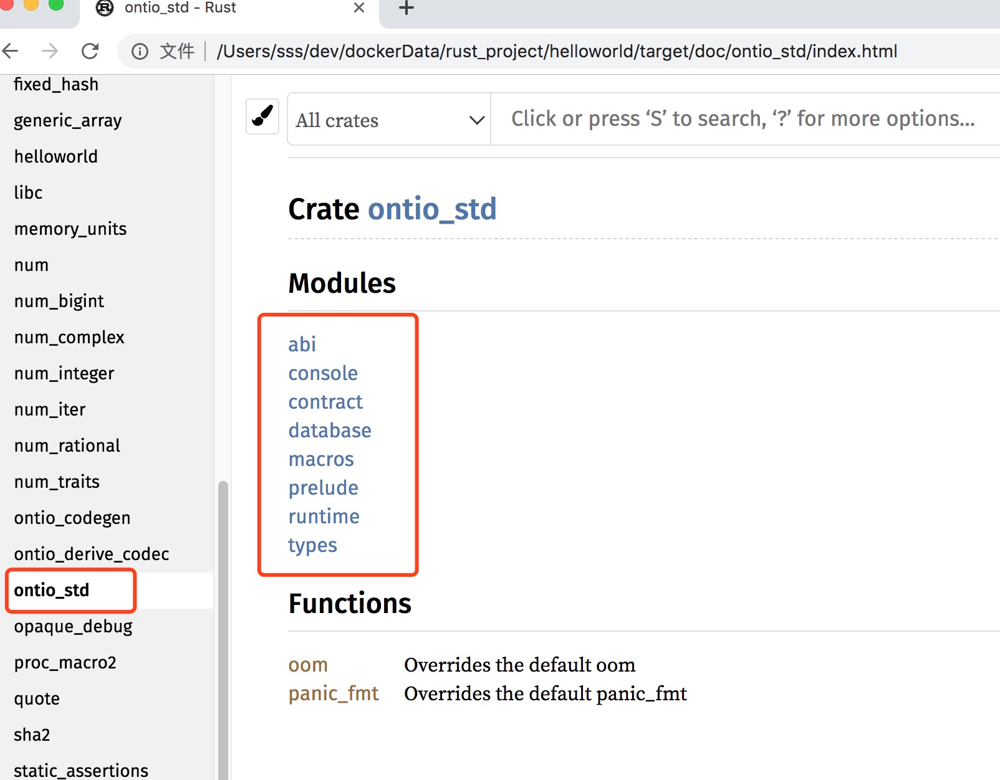

# Ontology WASM合约教程

## 开始
Ontology WASM合约支持RUST和C++语言开发，本文将会详细介绍如何使用RUST语言开发Ontology WASM合约。为了提高开发的效率，建议在开发合约之前，先准备好如下的环境。
* Rust开发环境（必须）

* IDE(推荐)

Clion是一款功能强大的C/C++/Rust开发工具，支持单步调式，方便WASM合约本地调试。

* 本地WASM合约测试节点（推荐）

搭建本地测试节点，方便合约测试，可以通过在合约中添加`debug`信息，在节点日志中监控合约运行信息。当然，如果觉得自己搭建测试节点较复杂，我们也可以使用测试网来测试合约。

## 环境搭建

### Rust开发环境搭建

1. 安装rustup, 非windows系统可以直接执行下面的命令。
```
curl https://sh.rustup.rs -sSf | sh
```
如果是windows系统，请访问[官网](https://www.rust-lang.org/zh-CN/tools/install)下载合适的版本进行安装。

2. 安装rust编译器
```
rustup install nightly
```

设置默认的编译版本nightly
```
rustup default nightly
```
3. 安装wasm32编译目前
```
rustup target add wasm32-unknown-unknown
```

4. 安装`ontio-wasm-build`工具

我们使用`cargo`工具把合约编译成wasm字节码时，生成的文件会比较大，`ontio-wasm-build`可以优化字节码，从而减小合约文件大小，此外，该工具还可以校验wasm字节码中是否含有非法的字节码。

具体安装方法请参考[ontio-wasm-build](https://github.com/ontio/ontio-wasm-build.git)

5. 安装集成开发环境

IDE和编辑工具推荐Clion,IntelliJ,vim等

### 本地测试节点搭建（推荐）

该部分请参考

[本地测试节点环境搭建](https://github.com/ontio/ontology#local-privatenet)

>注意：编译好的可执行文件在启动的时候，请设置日志级别为debug模式，该模式下方便查看合约运行的debug信息。

## 从hello world说起

rust写的合约源代码要想在Ontology链上运行，需要先进行编译成wasm字节码，然后将wasm字节码部署到链上，最后在调用合约中的方法，下面会给出一个简单的例子，介绍一下整个流程。

### 使用合约模板开发WASM合约
1. 从github上面clone合约模板
```
git clone https://github.com/ontio/rust-wasm-contract-template.git
```
目录结构如下
```
.
├── .cargo
│   └── config
├── Cargo.toml
├── build.sh
└── src
    └── lib.rs
```
* `.cargo`文件夹下面的`config`文件中配置了合约编译时的一些配置信息，
`config`文件内容如下
```
[target.wasm32-unknown-unknown]
rustflags = [
	"-C", "link-args=-z stack-size=32768"
]
```
`[target.wasm32-unknown-unknown]`表示编译目标，
`rustflags` 配置了编译的链接参数，默认的栈大小为32768，即32kb。

* `Cargo.toml`文件是合约的一些基本配置信息，其内容是
```
[package]
name = "rust-wasm-contract-template"
version = "0.1.0"
authors = ["laizy <aochyi@126.com>"]
edition = "2018"

# See more keys and their definitions at https://doc.rust-lang.org/cargo/reference/manifest.html

[lib]
crate-type = ["cdylib"] #Compile as a dynamic link library

[dependencies]
ontio-std = {git = "https://github.com/ontio/ontology-wasm-cdt-rust"}

[features]
mock = ["ontio-std/mock"]
```

在`[lib]`配置模块中，`crate-type = ["cdylib"]` 表示将项目编译动态链接库，用于被其他语言调用，`path = "src/lib.rs"`用于指定库文件路径。
`[dependencies]`用于配置项目依赖信息，这里引入了Ontology wasm合约开发需要的`ontio-std`库。
`[features]`用于开启一些不稳定特性，只可在nightly版的编译器中使用.

* `build.sh`文件里面封装好了编译合约和优化合约的功能，待合约开发完成后，执行该脚本会将优化后的合约字节码放到`output`目录下面。

* `src/lib.rs`用于编写合约逻辑代码，合约模板里面的代码如下
```
#![no_std]
use ontio_std::runtime;

#[no_mangle]
fn invoke() {
	runtime::ret(b"hello");
}
```

`#![no_std]` 表示屏蔽标准库中的接口。
`#[no_mangle]`表示在编译成wasm字节码时候，不对`invoke`函数名进行混淆。
`runtime`模块封装了合约与链交互的接口，`runtime::ret()`用于将合约执行的结果返回给调用方。
该合约实现了一个简单的返回hello功能。

2. 编译合约

直接执行`build.sh`脚本即可实现合约编译和合约字节码优化。
```
./build.sh
```
如果在执行的过程中出现如下错误
```
-bash: ./build.sh: Permission denied
```
请先给该文件可执行权限
```
sudo chmod +x ./build.sh
```
执行成功后，会在当前目录下生成`output`目录,output的目录结构如下
```
├── output
│   ├── rust_wasm_contract_template.wasm
│   └── rust_wasm_contract_template.wasm.str
```

3. 部署合约

编译好的wasm合约需要部署到链上，才能运行。我们可以将上面的合约字节码文件部署到测试网，或者本地测试节点，下面以部署到本地测试网为例：

首先，启动本地测试节点，在启动之前，我们需要先生成钱包文件
```
./ontology account add
```
上面命令在执行的过程中用默认配置即可，再执行下面的命令启动本地测试节点
```
./ontology --testmode --loglevel 1
```
`--loglevel 1` 表示节点的日志级别是`debug`，测试合约中如果有debug信息，会在节点日志中显示出来。

其次，在另外一个终端窗口部署合约，

```
sss@sss ontology (master) $ ./ontology contract deploy --vmtype 3 --code ./rust_wasm_contract_template.wasm.str --name helloworld --author "author" --email "email" --desc "desc" --gaslimit 22200000
Password:
Deploy contract:
  Contract Address:0be3df2e320f86f55709806425dc1f0b91966634
  TxHash:bd83f796bfd79bbb2546978ebd02d5ff3a54c2a4a6550d484689f627513f5770

Tip:
  Using './ontology info status bd83f796bfd79bbb2546978ebd02d5ff3a54c2a4a6550d484689f627513f5770' to query transaction status.
```

如果出现gaslimit不够的错误信息，请设置更大的gaslimit参数

4. 测试合约

现在我们来调用合约中的方法，执行如下的命令
```
sss@sss ontology (master) $ ./ontology contract invoke --address 0be3df2e320f86f55709806425dc1f0b91966634 --vmtype 3 --params '' --version 0 --prepare
Invoke:346696910b1fdc2564800957f5860f322edfe30b Params:null
Contract invoke successfully
  Gas limit:20000
  Return:68656c6c6f (raw value)
```
为了能够看到合约执行返回的结果，我们在命令后面加了`--prepare`标签，表示该交易是预执行交易。
合约中我们返回的是"hello"，为什么在命令行我们得到的是`68656c6c6f`，其实这是`hello`的hex编码格式而已，我们仅需用hex解码即可。


### 自己动手从零开始

合约模板使用起来虽然简单，但是遮住了我们探寻真相的双眼，下面我们就自己动手从0开始开发Ontology wasm合约。

1. 新建一个helloworld合约

```
sss@sss rust_project $ cargo new --lib helloworld
     Created library `helloworld` package
```

新建的合约目录结构如下
```
.
├── Cargo.toml
└── src
    └── lib.rs
```
一个rust版本的wasm合约包含两部分组成，一部分是`Cargo.toml`配置文件，用于配置项目信息，一部分是`src/lib.rs`用于编写合约逻辑。

2. 引入Ontology wasm合约开发工具库`ontio-std`，
在生成的`Cargo.toml`文件中引入`ontio-std`库
```
[package]
name = "helloworld"
version = "0.1.0"
authors = ["Lucas <sishsh@163.com>"]
edition = "2018"

# See more keys and their definitions at https://doc.rust-lang.org/cargo/reference/manifest.html

[dependencies]
ontio-std = {git="https://github.com/ontio/ontology-wasm-cdt-rust.git"}
```
在`[dependencies]`配置项引入Ontology wasm合约工具库。
由于我们合约要以库的形式进行编译，所以还需要在`Cargo.toml`文件里加上`[lib]`配置信息，一个完整的Cargo.toml配置文件如下：
```toml
[package]
name = "helloworld"
version = "0.1.0"
authors = ["Lucas <sishsh@163.com>"]
edition = "2018"

# See more keys and their definitions at https://doc.rust-lang.org/cargo/reference/manifest.html
[lib]
crate-type = ["cdylib"]
path = "src/lib.rs"
[dependencies]
ontio-std = {git="https://github.com/ontio/ontology-wasm-cdt-rust.git"}
```
在`[lib]`配置模块中，`crate-type = ["cdylib"]` 表示将项目编译动态链接库，用于被其他语言调用，`path = "src/lib.rs"`用于指定库文件路径。

3. 生成ontio-std库api文件

虽然我们引入了开发ontology wasm合约需要的工具库，但是我们还不知道该工具库中都是有哪些接口可以用，我们可以通过下面的命令生成该库的api文档。
```
cargo doc
```
执行成功后的目录结构如下
```
.
├── Cargo.lock
├── Cargo.toml
├── src
│   └── lib.rs
└── target
    ├── debug
    └── doc
```
生成的api接口文档在doc目录下。我们可以通过浏览器打开settings.html文件查看。如下图所示


请在左侧目录栏，找到ontio_std库，点击该选项，如下图：


4. 编写合约逻辑

新建的helloworld合约`lib.rs`文件内容是
```rust
#[cfg(test)]
mod tests {
    #[test]
    fn it_works() {
        assert_eq!(2 + 2, 4);
    }
}
```
仅有一个测试代码,在项目根目录下，执行`cargo test` 来执行该测试代码。下面开始编写合约逻辑：

第一步:在`lib.rs`文件中引入刚才在`Cargo.toml`配置文件中添加的`ontio-std`依赖，

为了屏蔽`rust`标准库中的方法，我们加上`#![no_std]`注解
```rust
#![no_std]
extern crate ontio_std as ostd;

#[cfg(test)]
mod tests {
    #[test]
    fn it_works() {
        assert_eq!(2 + 2, 4);
    }
}
```
第二步: 添加`invoke`函数,并在`invoke`函数中返回`hello world`
```rust
#![no_std]
extern crate ontio_std as ostd;
use ostd::runtime;
#[no_mangle]
fn invoke() {
    runtime::ret("hello world".as_bytes());
}

#[cfg(test)]
mod tests {
    #[test]
    fn it_works() {
        assert_eq!(2 + 2, 4);
    }
}
```
把合约执行的结果返回给调用合约的程序，需要使用`runtime::ret()`方法，`runtime`模块封装与链交互的接口。
至此一个简单的返回`hello world`的函数已经完成，然后我们测试一下该合约。

5. 编译合约

用rust编写的合约源代码需要编译成WASM字节码，才能部署到链上，执行下满面的命令编译合约

```
RUSTFLAGS="-C link-arg=-zstack-size=32768" cargo build --release --target wasm32-unknown-unknown
```
在上面的命令中，`RUSTFLAGS="-C link-arg=-zstack-size=32768"`表示设置rustc编译时使用的栈大小为32kb，rustc编译默认设置的栈内存大小是1M，对合约来说是巨大的浪费，因此在编译时设置下栈的大小，32kb对于绝大多数合约来说是够用的。
`wasm32-unknown-unknown` 表示在编译成目标字节码时，使用`llvm`后端编译工具，它适合纯rust代码编译，跟emscripten目标比起来，它默认就生成更加洗练的代码。

该代码执行后，会生成`target`文件夹，目录结构如下
```
.
├── release
│   ├── build
│   ├── deps
│   ├── examples
│   └── incremental
└── wasm32-unknown-unknown
    └── release
```

编译好的合约字节码文件位于`target`目录下的`wasm32-unknown-unknown/release`目录下文件名为`helloworld.wasm`的文件。

编译好的`wasm`字节码文件会比较大，部署到链上需要的存储空间会比较，费用也会比较高，但是我们可以使用`ontio-wasm-build`工具将wasm字节码减小。

6. 测试合约

首先，生成钱包文件，本地测试网启动需要钱包文件，执行如下的命令
```
./ontology account add
```
其次，启动我们搭建好的本地测试网节点，执行下面的命令
```shell
./ontology --testmode --loglevel 1
```

`--testmode`表示以测试的模式启动。

`--loglevel 1` 表示将日志级别设置为debug模式。

然后，部署合约
```
sss@sss ontology (master) $ ./ontology contract deploy --vmtype 3 --code ./helloworld.wasm.str --name helloworld --author "author" --email "email" --desc "desc" --gaslimit 22200000
Password:
Deploy contract:
  Contract Address:d9b7dde144cf8ee47739fc4e13dfa503afb5786c
  TxHash:e6831d297472e2a2a4263f5cb83b3c61d2f36aac8fd10d613cc569c9860bf44d

Tip:
  Using './ontology info status e6831d297472e2a2a4263f5cb83b3c61d2f36aac8fd10d613cc569c9860bf44d' to query transaction status.
```

`--vmtype 3` 表示部署的合约类型是`wasm`合约，目前Ontology链除了支持`wasm`合约还支持`neovm`合约，部署的时候要注明合约类型。
`--name helloworld` 表示部署合约名字是`helloworld`。
`--author "author"` 表示部署合约作者是`author`。
`--email "email"` 表示部署合约email是`email`。
`--gaslimit 22200000`表示部署合约需要的费用gaslimit上限是`22200000`。

>注意，需要先将wasm字节码文件转换成hex文件后，在执行上面的方法

最后，调用合约中的方法,由于我们在invoke函数里直接返回了，并没有定义其他的方法，所以，调用合约的时候，不需要传参数。因为合约中没有更新链上数据的方法，仅仅只是返回`hello world`，我们在调用合约的时候，要加上预执行标签`--prepare`，否则，我们看不到合约返回的结果
根据合约地址调用合约中的方法。该部分详细信息请参考[命令行合约调用](https://github.com/ontio/ontology/blob/master/docs/specifications/cli_user_guide_CN.md#52-%E6%99%BA%E8%83%BD%E5%90%88%E7%BA%A6%E6%89%A7%E8%A1%8C)
```
sss@sss ontology (master) $ ./ontology contract invoke --address d9b7dde144cf8ee47739fc4e13dfa503afb5786c --vmtype 3 --params '' --version 0 --prepare
Invoke:6c78b5af03a5df134efc3977e48ecf44e1ddb7d9 Params:null
Contract invoke successfully
  Gas limit:20000
  Return:68656c6c6f20776f726c64 (raw value)
```

合约中我们的返回值是`hello world`，为什么执行结果却是`68656c6c6f20776f726c64`呢？这是因为合约中返回的数据，会进行hex编码，我们按照hex解码即可。


至此，一个简单的合约已经完成了。


下面我们再来让helloworld合约稍微复杂一点

`Cargo.toml`配置文件如下

```toml
[package]
name = "helloworld"
version = "0.1.0"
authors = ["lucas7788 <sishsh@163.com>"]
edition = "2018"

[lib]
crate-type = ["cdylib"]
path = "src/lib.rs"

[dependencies]
ontio-std = {git="https://github.com/ontio/ontology-wasm-cdt-rust.git"}

[features]
mock = ["ontio-std/mock"]
```
* `[features]`用于开启一些不稳定特性，只可在nightly版的编译器中使用.

合约逻辑代码如下`lib.rs`
```rust
#![no_std]
extern crate ontio_std as ostd;
use ostd::abi::{Sink, Source};
use ostd::prelude::*;
use ostd::runtime;

fn say_hello() -> String {
    return "hello world".to_string();
}

#[no_mangle]
pub fn invoke() {
    let input = runtime::input();
    let mut source = Source::new(&input);
    let action: &[u8] = source.read().unwrap();
    let mut sink = Sink::new(12);
    match action {
        b"hello" => sink.write(say_hello()),
        _ => panic!("unsupported action!"),
    }
    runtime::ret(sink.bytes())
}

#[test]
fn test_hello() {
    let res = say_hello();
    assert_eq!(res, "hello world".to_string());
}
```
该合约有四部分组成，第一部分是库引入模块，代码如下
```rust
#![no_std]
extern crate ontio_std as ostd;
use ostd::abi::{Sink, Source};
use ostd::prelude::*;
use ostd::runtime;
```
库`ontio_std`是在`Cargo.toml`配置文件中`[dependencies]`模块引入的，并且使用别名`ostd`,然后就可以使用`ostd`引用`ontio_std`库中的接口。
`Sink`和`Source`用于合约中数据的序列化和反序列化，`prelude`模块中封装了一些常用的方法和数据类型比如Address、U128等。`runtime`模块封装了与链交互的API。

第二部分是合约中的方法，该方法仅仅是返回`hello world`字符串，代码如下。
```rust
fn say_hello() -> String {
    return "hello world".to_string();
}
```


第三部分是合约入口函数`invoke`,这是Ontology wasm合约的一个约定，在Ontology 虚拟机执行wasm合约的时候会首先去读取`invoke`函数，从`invoke`函数开始执行合约逻辑, 此外，`invoke`函数被`#[no_mangle]`修饰，表示在对合约源代码进行编译成字节码的时候，rust编译器不会为它进行函数名混淆。
```rust
#[no_mangle]
pub fn invoke() {
    let input = runtime::input();
    let mut source = Source::new(&input);
    let action: &[u8] = source.read().unwrap();
    let mut sink = Sink::new(12);
    match action {
        b"hello" => sink.write(say_hello()),
        _ => panic!("unsupported action!"),
    }
    runtime::ret(sink.bytes())
}
```
该合约的基本逻辑是，
第一步，从`runtime::input()`获得调用合约的方法名和参数内容，`runtime`模块是`ontology-wasm-cdt-rust`工具集封装好的与链交互的api，`input`方法可以获得链在调用合约时传进来的方法名和参数信息。
第二步，`let mut source = Source::new(&input);`构造反序列化对象，读出调用的方法名以及方法参数信息。
第三步，根据读到的方法名匹配到相应的方法处执行，
```rust
match action {
    b"hello" => sink.write(say_hello()),
    _ => panic!("unsupported action!"),
}
```
第四步，将合约执行结果使用`sink`进行序列化,调用`runtime::ret()`将序列化好的合约执行结果返回。

第四部分是合约中的方法测试部分，代码如下
```rust
#[test]
fn test_hello() {
    let res = say_hello();
    assert_eq!(res, "hello world".to_string());
}
```
测试函数需要使用`#[test]`注解，表示该函数是一个测试函数，如果测试的函数中含有获取链上信息的方法，可以使用`mock`目录下面的`runtime`对链上接口的模拟实现api，具体的例子可以参考`examples`目录下面的`apitest`合约例子。
执行该测试方法需要执行如下的命令
```
cargo test --features='mock'
```

### 合约编译

为了使得合约部署到链上执行，我们需要将合约编译成wasm字节码，合约编译我们可以直接使用`cargo`工具进行编译，先进入合约根目录，然后执行如下的命令
```
RUSTFLAGS="-C link-arg=-zstack-size=32768" cargo build --release --target wasm32-unknown-unknown
```
`RUSTFLAGS="-C link-arg=-zstack-size=32768"`表示设置rustc编译时使用的栈大小为32kb，rustc编译默认设置的栈内存大小是1M，对合约来说是巨大的浪费，因此在编译时设置下栈的大小，32kb对于绝大多数合约来说是够用的。
`wasm32-unknown-unknown` 表示在编译成目标字节码时，使用`llvm`后端编译工具，它适合纯rust代码编译，跟emscripten目标比起来，它默认就生成更加洗练的代码。

该代码执行后，会生成`target`文件夹，目录结构如下
```
.
├── release
│   ├── build
│   ├── deps
│   ├── examples
│   └── incremental
└── wasm32-unknown-unknown
    └── release
```
编译好的合约字节码文件位于`target`目录下的`wasm32-unknown-unknown/release`目录下。

编译好的`wasm`字节码文件会比较大，部署到链上需要的存储空间会比较，费用也会比较高，但是我们可以使用`ontio-wasm-build`工具将wasm字节码减小。优化命令如下
```
ontio-wasm-build ./helloworld.wasm ./helloworld_optimized.wasm
```


### Contract Deploying
可以通过`ontology`命令行工具将合约部署到链上
```
./ontology contract deploy --vmtype 3 --code ./helloworld.wasm.str --name helloworld --author "author" --email "email" --desc "desc" --gaslimit 22200000
```
`--vmtype 3` 表示部署的合约类型是`wasm`合约，目前Ontology链除了支持`wasm`合约还支持`neovm`合约，部署的时候要著名合约类型。
`--name helloworld` 表示部署合约名字是`helloworld`。
`--author "author"` 表示部署合约作者是`author`。
`--email "email"` 表示部署合约email是`email`。
`--gaslimit 22200000`表示部署合约需要的费用gaslimit上限是`22200000`。

>注意，需要先将wasm字节码文件转换成hex文件后，在执行上面的方法

### Contract Testing
调用合约中的方法
```
./ontology contract invoke --address 51113dbe9e984939c0435eacfcf4c78d50525090 --vmtype 3 --params 'string:hello' --version 0 --return string
```
根据合约地址调用合约中的方法。该部分详细信息请参考[命令行合约调用](https://github.com/ontio/ontology/blob/master/docs/specifications/cli_user_guide_CN.md#52-%E6%99%BA%E8%83%BD%E5%90%88%E7%BA%A6%E6%89%A7%E8%A1%8C)

## ontology-wasm-cdt-rust介绍
`ontio-cdk`是用于使用rust开发面向ontology的WebAssembly智能合约工具套件, 包含合约编写的标准库，链上交互的运行时api，合约接口abi生成插件，合约测试框架等。
### ontio-std介绍

* 和链交互的运行时API接口
* 合约级别的存储管理
* 合约测试框架
* abi和client端代码生成

#### 生成API文档
1. 将项目clone到本地
```
git clone https://github.com/ontio/ontology-wasm-cdt-rust.git
```
2. 进入项目目录执行
```
cargo doc
```
生成cdt的接口文档，生成的接口文档在当前目录下面的target文件夹下面的doc目录下,通过浏览器打开该目录下的`settings.html`文件，可以查看cdt提供的接口信息。

#### abi模块介绍
数据的序列化和反序列化是合约中经常使用的方法，在读取调用的合约方法名和方法参数或者需要读取链上数据的时候，需要对字节数组进行反序列化，在将合约执行结果返回或者将数据保存到链上的时候，需要对合约执行结果或者要保存的数据进行序列化。abi模块封装了合约中常用数据类型的序列化和反序列化方法，方便开发者直接使用。
1. `Sink`: 用于合约中数据类型的序列化
对于实现`Encoder`接口的数据类型都可以直接用`sink.write()`方法进行序列化,
`sink`进行初始化的时候,会初始化一个Vec,需要指定其初始化大小，该Vec用于存储序列化的结果。

示例
```
let mut sink = Sink::new(16);
sink.write(83u8);
sink.write("transfer".to_string());
```

`Source`: 用于合约中数据的反序列化

对于实现`Decoder`接口类型的数据类型可以直接用`source.read().unwrap()`方法进行反序列化

示例
```
let input = runtime::input();
let mut source = Source::new(&input);
let (from, to, amount) = source.read().unwrap();
```

2. console 模块

- `debug`：用于在合约中打印调试信息

示例
```
 console::debug("debug");
```
>注意：测试节点启动的时候，日志级别要设置为debug模式，该信息才会打印出来。

3. notify 模块
- `notify(data: &[u8])`:用于将合约中运行的信息保存到链上，可以通过查询合约事件的方法查询该信息，用于监控合约运行信息，

`debug`模块也可以用于监控合约运行信息，但是debug模块的信息不会保存到链上，不可以通过查询事件的方式查询。

4. contract模块
该模块封装了wasm合约中调用`ont`和`ong`的相关方法，方便合约开发者，在wasm合约中调用`ont`或者`ong`转账等方法。
- `ong`：封装了在合约中调用ong的相关操作，例如转账、查询余额等。
   - `allowance(from: &Address, to: &Address)` 查询allowance余额
     示例
    ```
    use ostd::contract::ont;
    ont::allowance(from, to)
    ```
   - `approve(from: &Address, to: &Address, amount: U128)` 一个地址允许另一个地址转移多少资产

     示例
    ```
    use ostd::contract::ont;
    ont::approve(from, to, amount)
    ```
   - `balance_of` 查询余额

     示例：
     ```
     use ostd::contract::ont;
     ong::balance_of(address)
     ```
   - `transfer` 转账,从`from`地址转移`amount`数量的`ong`到`to`地址

     示例
    ```
    let state = ont::State { from: from.clone(), to: to.clone(), amount: amount };
    ont::transfer(&[state])
    ```
   - `transfer_from`

     示例
    ```
    ont::transfer_from(sender, from, to, amount)
    ```
- `ont`:封装了在合约中调用ont的相关操作,调用方法和ong类似。


5. database 模块
- `delete`: 根据key删除数据库中的数据
- `get<K: AsRef<[u8]>, T>(key: K) -> Option<T> where for<'a> T: Decoder<'a> + 'static`: 根据key查询数据，
- `put`   : 根据key存储数据

示例：
```
use ostd::database;
database::put(from, frmbal);
let balance = database::get(owner).unwrap_or(0);
```

6. types 模块
- `Address`: 地址，是长度为20的字节数组
- `U128`   : 小端序的大整数。

7. runtime 模块

该模块封装了合约和链交互的api，开发者可以调用一下接口获得链的信息或者更新链上数据。

- `timestamp() -> u64` 获得当前时间戳

示例
```
runtime::timestamp()
```
- `block_height() -> u32` 获得当前区块高度

示例
```
runtime::block_height()
```
- `address() -> Address` 获得当前合约地址

示例
```
runtime::address()
```

- `caller() -> Address` 获得调用者的合约地址

示例
```
runtime::caller()
```
- `current_blockhash() -> H256` 获得当前区块hash

示例
```
runtime::current_blockhash()
```
- `current_txhash() -> H256` 获得当前交易hash

示例
```
runtime::current_txhash()
```
- `check_witness(addr: &Address) -> bool` 校验签名

示例
```
runtime::check_witness(addr)
```
- `ret(data: &[u8]) -> !` 合约执行结束时调用，返回执行结果

示例
```
let mut dispatcher = ApiTestDispatcher::new(ApiTestInstance);
runtime::ret(&dispatcher.dispatch(&runtime::input()));
```
- `notify(data: &[u8])` 合约中推送事件

示例
```
runtime::notify("success".as_bytes());
```
- `contract_create(
    code: &[u8], need_storage: u32, name: &str, ver: &str, author: &str, email: &str, desc: &str,
) -> Option<Address>` 
创建合约,在合约中通过该接口可以创建一个新的合约

`code`:合约字节码

`need_storage`:是否需要存储

`name`:合约名

`version`:合约版本

`author`:作者

`email`:邮箱信息

`desc`:合约描述信息。

示例
```
let code = &[
    0x00, 0x61, 0x73, 0x6d, 0x01, 0x00, 0x00, 0x00, 0x01, 0x12, 0x03, 0x60, 0x00, 0x00,
    0x60, 0x02, 0x7f, 0x7f, 0x00, 0x60, 0x05, 0x7f, 0x7f, 0x7f, 0x7f, 0x7f, 0x01, 0x7f,
    0x02, 0x2d, 0x02, 0x03, 0x65, 0x6e, 0x76, 0x0c, 0x6f, 0x6e, 0x74, 0x69, 0x6f, 0x5f,
    0x72, 0x65, 0x74, 0x75, 0x72, 0x6e, 0x00, 0x01, 0x03, 0x65, 0x6e, 0x76, 0x12, 0x6f,
    0x6e, 0x74, 0x69, 0x6f, 0x5f, 0x73, 0x74, 0x6f, 0x72, 0x61, 0x67, 0x65, 0x5f, 0x72,
    0x65, 0x61, 0x64, 0x00, 0x02, 0x03, 0x02, 0x01, 0x00, 0x05, 0x03, 0x01, 0x00, 0x01,
    0x07, 0x0a, 0x01, 0x06, 0x69, 0x6e, 0x76, 0x6f, 0x6b, 0x65, 0x00, 0x02, 0x0a, 0x5b,
    0x01, 0x59, 0x00, 0x41, 0x00, 0x41, 0x25, 0x3a, 0x00, 0x00, 0x41, 0x00, 0x41, 0x01,
    0x41, 0x08, 0x41, 0x08, 0x41, 0x00, 0x10, 0x01, 0x41, 0x08, 0x47, 0x04, 0x40, 0x00,
    0x0b, 0x41, 0x08, 0x29, 0x03, 0x00, 0x42, 0x97, 0x85, 0xce, 0x00, 0x52, 0x04, 0x40,
    0x00, 0x0b, 0x41, 0x00, 0x41, 0x14, 0x3a, 0x00, 0x00, 0x41, 0x00, 0x41, 0x01, 0x41,
    0x08, 0x41, 0x08, 0x41, 0x00, 0x10, 0x01, 0x41, 0x08, 0x47, 0x04, 0x40, 0x00, 0x0b,
    0x41, 0x08, 0x29, 0x03, 0x00, 0x42, 0xb3, 0xce, 0x0c, 0x52, 0x04, 0x40, 0x00, 0x0b,
    0x41, 0x08, 0x41, 0x08, 0x10, 0x00, 0x0b,
];
let contract_addr = runtime::contract_create(code, 1,"oep4","1.0","author","email","desc").unwrap_or(Address::zero());
```

- `fn contract_migrate(
    code: &[u8], vm_type: u32, name: &str, version: &str, author: &str, email: &str, desc: &str,
) -> Option<Address>`

合约升级

`code`:合约字节码

`vm_type`:虚拟机类型

`name`:合约名

`version`:合约版本

`author`:作者

`email`:邮箱信息

`desc`:合约描述信息。

示例
```
let address =runtime::contract_migrate(code, 3, "name", "version", "author", "email", "desc")
    .expect("migrate failed");
```

- `call_contract(addr: &Address, input: &[u8]) -> Option<Vec<u8>>` 跨合约调用
  - `addr`目标合约地址
  - `input` 调用目标合约的参数
  
由于调用wasm合约和调用neovm合约参数序列化方式不一样，所以，需要区别对待，

1. wasm调用wasm合约

wasm合约调用另外一本wasm合约时，参数序列化规则是，先序列化方法名，在序列化被调用合约方法需要的参数。

示例
```
let mut sink = Sink::new(16);
sink.write(("transfer".to_string(), from, to, amount));
let res = runtime::call_contract(contract, sink.bytes());
if res.is_some() {
    true
} else {
    false
}
```
2. wasm调用neovm合约

待定

### 常用的数据类型转换介绍
- `u64`转换成`string`
示例
```
let s = 123.to_string();
```
- `base58`编码的地址转换成`Address`
示例
```
let address = ostd::base58!("AFmseVrdL9f9oyCzZefL9tG6UbvhPbdYzM");
```
- `u128_to_neo_bytes(data: U128) -> Vec<u8>` U128数据类型转换成字节数组

示例
```
 let bs = u128_to_neo_bytes(256 as U128);
```
- `u128_from_neo_bytes(buf: &[u8]) -> U128`字节数组转换成U128

示例
```
 let bs = u128_to_neo_bytes(256 as U128);
 let u = u128_from_neo_bytes(&bs);
```

## Start writing Contarct
1. 新建合约
```
cargo new --lib oep4-contract
```

生成的目录结构
```
ubuntu@ubuntu oep4-contract $ tree
.
├── Cargo.toml
└── src
    └── lib.rs
```

`cargo.toml` 文件用于配置项目基本信息和项目依赖信息等
`lib.rs`文件用于编写合约逻辑

2. 编辑`Cargo.toml`，添加`ontio-cdk`依赖:
```toml
[package]
name = "mycontract"
version = "0.1.0"
authors = ["laizy <aochyi@126.com>"]
edition = "2018"

[lib]
crate-type = ["cdylib"] #编译为动态链接库

[dependencies]
ontio-std = {git = "https://github.com/ontio/ontology-wasm-cdt-rust"}

[features]
mock = ["ontio-std/mock"]
```

`crate-type = ["cdylib"]` 表示将项目编译动态链接库，用于被其他语言调用。

3. 在src/lib.rs中开发合约，合约的基本结构如下：

```rust
#![no_std]
use ontio_std::runtime;

// 合约的入口函数，使用no_mangle使其在编译后作为wasm合约的导出函数
#[no_mangle]
pub fn invoke() {
    runtime::ret(b"hello, world");//将合约的执行结果返回
}
```
`#![no_std]`表示不使用标准库中的方法
`#[no_mangle]` 函数修饰符，被其修饰的函数，rust编译器不会为他进行函数名混淆。

4. Oep4合约示例

```rust
#![no_std]
extern crate ontio_std as ostd;

use ostd::abi::{Encoder, Sink, Source};
use ostd::prelude::*;
use ostd::{database, runtime};

const KEY_TOTAL_SUPPLY: &str = "total_supply";
const NAME: &str = "wasm_token";
const SYMBOL: &str = "WTK";
const TOTAL_SUPPLY: U128 = 100000000000;

fn initialize() -> bool {
    database::put(KEY_TOTAL_SUPPLY, TOTAL_SUPPLY);
    true
}

fn balance_of(owner: &Address) -> U128 {
    database::get(owner).unwrap_or(0)
}

fn transfer(from: &Address, to: &Address, amount: U128) -> bool {
    assert!(runtime::check_witness(from));

    let frmbal = balance_of(from);
    let tobal = balance_of(to);
    if amount == 0 || frmbal < amount {
        return false;
    }

    database::put(from, frmbal - amount);
    database::put(to, tobal + amount);
    notify(("Transfer", from, to, amount));
    true
}

fn total_supply() -> U128 {
    database::get(KEY_TOTAL_SUPPLY).unwrap()
}

#[no_mangle]
pub fn invoke() {
    let input = runtime::input();
    let mut source = Source::new(&input);
    let action = source.read().unwrap();
    let mut sink = Sink::new(12);
    match action {
        "init" => sink.write(initialize()),
        "name" => sink.write(NAME),
        "symbol" => sink.write(SYMBOL),
        "totalSupply" => sink.write(total_supply()),
        "balanceOf" => {
            let addr = source.read().unwrap();
            sink.write(balance_of(addr));
        }
        "transfer" => {
            let (from, to, amount) = source.read().unwrap();
            sink.write(transfer(from, to, amount));
        }
        _ => panic!("unsupported action!"),
    }

    runtime::ret(sink.bytes())
}

fn notify<T: Encoder>(msg: T) {
    let mut sink = Sink::new(16);
    sink.write(msg);
    runtime::notify(sink.bytes());
}
```


